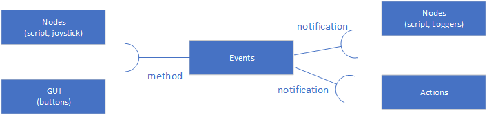
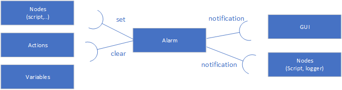
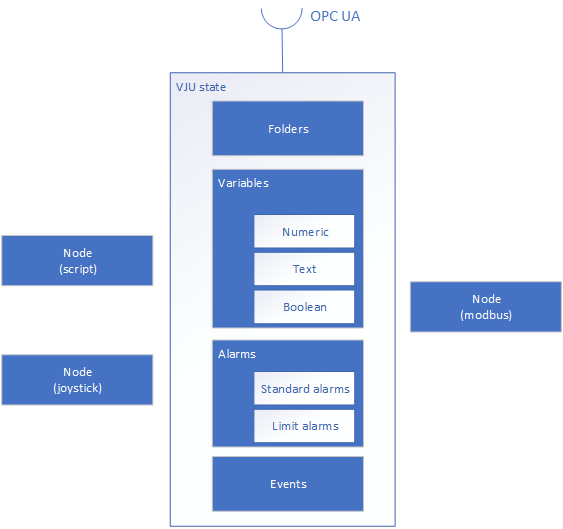

Vju 3 main concepts
===================

Vju platform consists of a number of core components. These are always available and are also used by plugins to extend functionality of Vju. Core items are listed below:

* Variables
* Alarms
* Folders
* Nodes
* Events

Variables
---------

There are support for the following variable types:

* Numeric
* Text
* Boolean
  
For numeric variables VJU uses a 64bit float to represent all number variables. 

Folders
-------

are used to organize items added to vju. The tree strucutre generated will be exposed over ref:: OPC UA. 

Events
------

Events are used to notify different part of application that something occurred. An example is a button is clicked in HMI, this activates the events by calling the invoke method on the event. 
The invoke method have an optional parameter of message that can be used to transferer information. On the listener side of the event there can be multiple listeners. So 1 method click in the HMI can start multiple actions.

Alarms
------

Vju Server
----------

