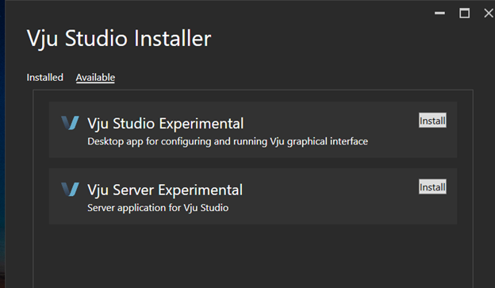

Installation
============

Vju can be downloaded from the following link:

Vju.Installer-win-x64.exe is the installer application for Vju Server and Vju Studio. This application is used to install latest version of VJU software without needing to download specific versions of Vju Server and Vju Studio. On startup it does a check of what is currently installed on your local machine. It will then display what is currently installed. One first start it will look like this:

Click the Available header to show latest available version of the software. If version you have installed on your local machine is older than what is available for download it will also show in available. 

List of available versions

    
Click install on the software that is needed.
 
Once installed the software will show up in the installed tab and a icon will be added to you desktop and start menu:

VJU 3 file extension 
--------------------
The installer will also associate the config files from the different vju applications with correct applications. With this association in place allows for double click on config files to start associated application.
tables

=========== ===========
file type   application  
=========== ===========
.vjus       VJU Server application
.vjui       VJU Studio application.
.vjulaunch  VJU launcher application
=========== ===========

