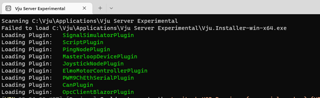

VJU 3 Server
============

To start VJU server click the Vju Server icon. This will create a default.vjus file under c:\\vju. 
This file will hold all configuration settings for your Vju Server project. 
If you would like to have multiple setup it is possible to rename or make copies of this file. 
It is also possible to move the file to another location. To start file if move or rename you will need to double click the \*.vjus file.
Once application is started you will see a console that looks something like below:

Vju 3 Server URL
----------------
Once Vju Server done initializing you can edit the configuration of the server setup by opening a web browser and entering URL: http://127.0.0.1:5100. Entering this URL you should see the following web page:

